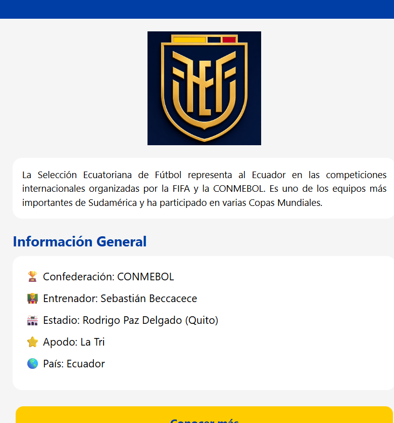

# 🇪🇨 Selección Ecuatoriana App

Aplicación móvil desarrollada con **React Native** y **Expo Go** como práctica introductoria al desarrollo móvil.

## Características

* Pantalla de bienvenida (Splash Screen).
* Logo de la Selección Ecuatoriana de Fútbol.
* Pantalla principal con información básica del equipo.
* Navegación entre pantallas utilizando Expo Router.

## Tecnologías utilizadas

* React Native
* Expo Go
* Expo Router
* TypeScript

## Requisitos

* Node.js 20 o superior
* Expo Go instalado en el dispositivo móvil
* Git

## Instalación

Clonar el repositorio:

```bash
git clone https://github.com/argalarza/expoGo.git
```

Ingresar al proyecto:

```bash
cd expoGo
```

Instalar dependencias:

```bash
npm install
```

## Ejecución

Iniciar el proyecto:

```bash
npx expo start
```

o limpiar caché:

```bash
npx expo start --clear
```

Escanear el código QR con Expo Go desde un dispositivo Android o iOS.

## Estructura del proyecto

```text
app
├── _layout.tsx
├── index.tsx
└── home.tsx

assets
└── logo.png
```

## Autor

Ricardo Galarza

## Repositorio

https://github.com/argalarza/expoGo

